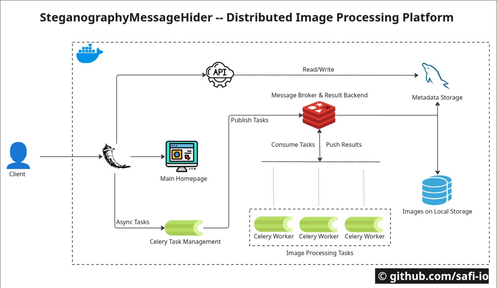
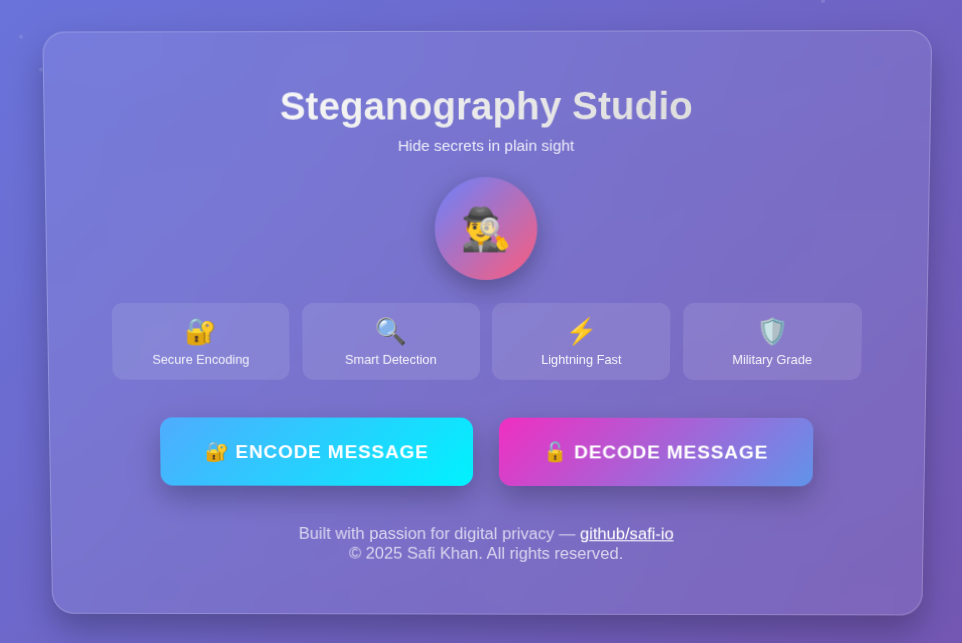
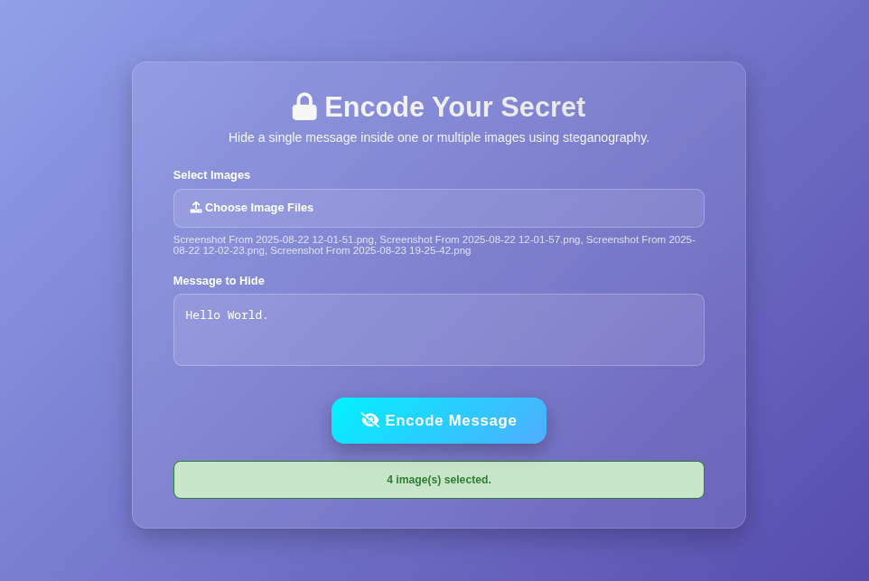
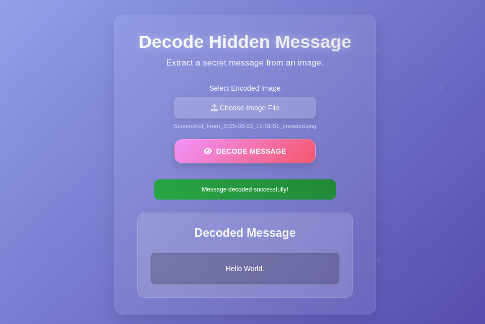
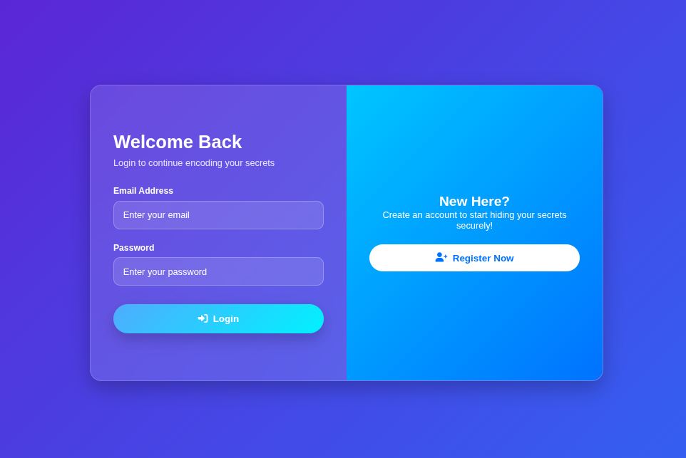
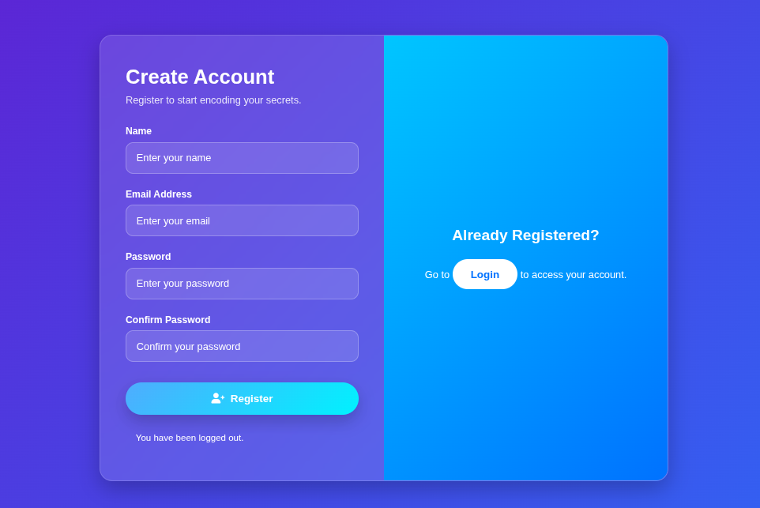

# Steganography Message Hider

**Steganography Message Hider** is a web-based steganography tool for hiding and extracting secret messages within images. The project features a fully asynchronous encoding workflow powered by **Celery** and **Redis**, allowing you to encode multiple images in parallel without blocking the web server. The backend is built in Python (Flask), and the frontend uses HTML, CSS, and JavaScript for a clean, responsive experience.

## Table of Contents

| Section | Description |
|---------|-------------|
| [Architecture Diagram](#architecture-diagram) | Visual overview of the system |
| [Features](#features) | Key features of the application |
| [How It Works (Celery Async Workflow)](#how-it-works-celery-async-workflow) | Step-by-step usage and async flow |
| [LSB Technique](#lsb-technique-how-messages-are-hidden) | Explanation of the steganography method |
| [Tech Stack](#tech-stack) | Technologies used |
| [Interface Previews](#interface-previews) | Screenshots of the UI |
| [Installation & Running (with Docker)](#installation--running-with-docker) | Setup instructions |
| [Project Structure](#project-structure) | File and folder organization |
| [Celery Async Tasks: How It Works](#celery-async-tasks-how-it-works) | Details of async task processing |
| [Security](#security) | Privacy and security features |
| [Contact](#contact) | How to reach the author |


---

## Architecture Diagram


---

## Features

- **Async Image Encoding**: Encode messages in images using background Celery tasks for fast, non-blocking processing.
- **Parallel Processing**: Multiple images can be encoded at once; each job is queued and processed independently.
- **Offline Capable**: Run locally without internet or external APIs.
- **Privacy-First**: All processing is local; no external data transfers.
- **MySQL Database Integration**: User accounts and history logs are stored in a scalable relational database.
---

## How It Works (Celery Async Workflow)

### Encoding (Async)
1. Upload one or more images and enter your secret message.
2. Each encoding job is sent to a **Celery** worker (using Redis as the broker).
3. The web server immediately returns a list of job/task IDs for your uploads.
4. You can check the status of each encoding job via the `/task-status/<task_id>` endpoint.
5. When jobs are complete, download the encoded images individually or as a zip file.

**Example Flow:**
- Upload images → Jobs queued (Celery) → Status checked → Download results

### Decoding
1. Upload an encoded image.
2. The backend extracts and returns the hidden message instantly.

---

### LSB Technique (How Messages Are Hidden)
The Least Significant Bit (LSB) technique modifies the last bit of each pixel’s RGB value to embed your message. This change is visually undetectable, making it ideal for steganography.

Example:
- Original Red value: `11100110` (230)
- After encoding: `11100111` (231)

This process is repeated across many pixels to hide the full message.

---

## Tech Stack
| Layer           | Technology                   |
|-----------------|------------------------------|
| Frontend        | HTML5, CSS3, JavaScript      |
| Backend         | Python 3, Flask, Celery      |
| Database        | MySQL (Flask-MySQL/pymysql)  |
| Authentication  | Flask-Login, Flask Sessions  |
| Image Processing| Pillow (PIL)                 |
| Async Tasks     | Celery + Redis               |

---

## Interface Previews

### Home Page
This is the page that welcomes you when you start the application (Steganography Studio).


### Encoding Page
On this page, you can upload the picture and write the text you want to hide in the image.
Example:
- Text: Hello World.


### Decoding Page
This page gives you the ability to decode the message by uploading the image.
Decoded Text:
- Hello World.


### Login Interface
This is the page where you can log in.


### Registration Interface
This is the page where you can register.


---

## Installation & Running (with Docker)

### Prerequisites
- Docker & Docker Compose

### Steps
```bash
# Clone the repository
git clone https://github.com/safi-io/SteganographyMessageHider
cd SteganographyMessageHider

# Build and start all services (Flask, MySQL, Redis, Celery)
docker-compose up --build

# Visit in your browser
http://127.0.0.1:5000
```

This will start:
- Flask web server (with hot reload)
- MySQL database
- Redis server (for Celery broker)
- Celery worker (for async encoding tasks)

You can monitor Celery logs in the `celery_worker` container.

---

## Project Structure
```bash
SteganographyMessageHider/
├── app.py
├── helper.py
├── requirements.txt
├── docker-compose.yml
├── Dockerfile
├── README.md
├── ProjectDocumentation.pdf
├── output/                # Encoded images and zip files
├── uploads/               # Uploaded images
├── routes/
│   ├── main.py
│   ├── encode.py
│   ├── decode.py
│   ├── auth.py
│   ├── history.py
├── utils/
│   ├── database.py
│   ├── login_decorator.py
│   ├── tasks.py           # Celery async tasks
├── static/
│   ├── css/
│   │   ├── index.css
│   │   ├── encode.css
│   │   ├── decode.css
│   │   ├── login.css
│   │   ├── register.css
│   ├── js/
│   │   ├── index.js
│   │   ├── encode.js
│   │   ├── decode.js
├── templates/
│   ├── index.html
│   ├── encode.html
│   ├── decode.html
│   ├── login.html
│   ├── register.html
│   ├── history.html
├── screenshots/           # UI screenshots
│   ├── homepage.png
│   ├── encoding.png
│   ├── decoding.png
│   ├── login.png
│   ├── register.png
```

---

## Celery Async Tasks: How It Works

Celery is the backbone of the encoding workflow. When you submit images for encoding:
- Each image/message pair is sent as a **Celery task** to a background worker.
- The web server stays responsive, instantly returning a list of job IDs.
- You can monitor the status of each job (PENDING, STARTED, SUCCESS, FAILURE) via the `/task-status/<task_id>` endpoint.
- When all jobs are complete, download your encoded images individually or as a zip file.

**Celery Task Example:**
```python
# utils/tasks.py
@celery.task
def encode_image_task(input_path, message, output_path):
    stego_encode(input_path, message, output_path)
    return output_path
```

**Triggering Tasks (Flask Route):**
```python
# routes/encode.py
for image_file in image_files:
    ...
    task = encode_image_task.delay(input_path, message, output_path)
    task_ids.append(task.id)
```

**Checking Status:**
```python
# routes/encode.py
@encode_bp.route('/task-status/<task_id>')
def task_status(task_id):
    task = encode_image_task.AsyncResult(task_id)
    return jsonify({"task_id": task_id, "status": task.status})
```

---

## Security

SteganographyMessageHider is built for privacy and security:
- **No External Data Transfers**: All processing is local; nothing is sent to third-party servers.
- **Temporary File Handling**: Uploaded files are stored only as long as needed and removed after processing.
- **No Analytics or Tracking**: No cookies, trackers, or analytics scripts.
- **Offline-Ready**: Run the app completely offline.
- **Local-Only Execution**: Backend and frontend communicate only on your machine.

> Your messages stay yours. SteganographyMessageHider ensures data confidentiality and local control.

---

## Contact

For any queries, please reach out at:

**Email:** [m.safi.ullah@outlook.com](mailto:m.safi.ullah@outlook.com)

---

Thank you for exploring!
