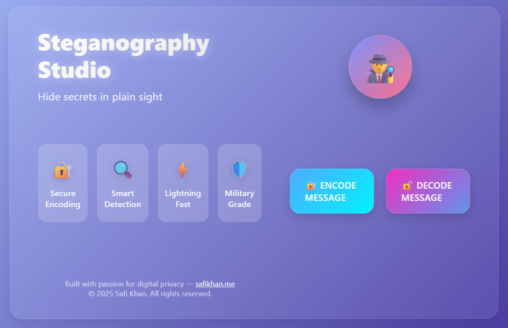
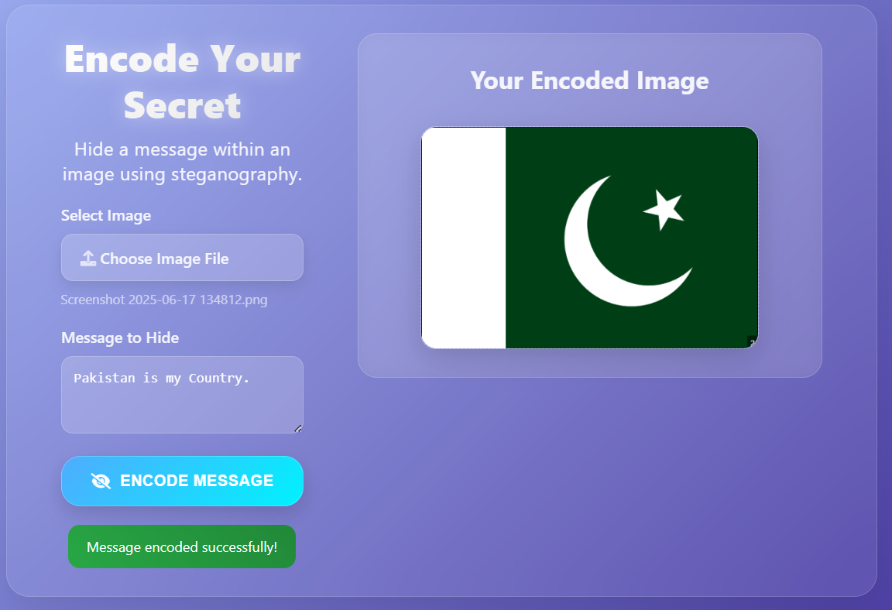
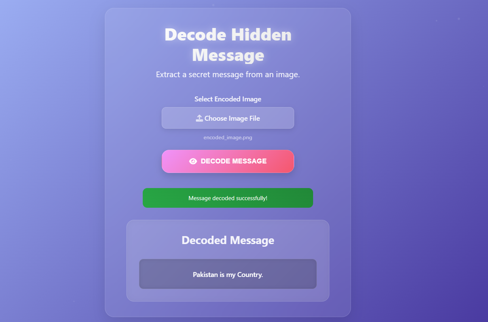
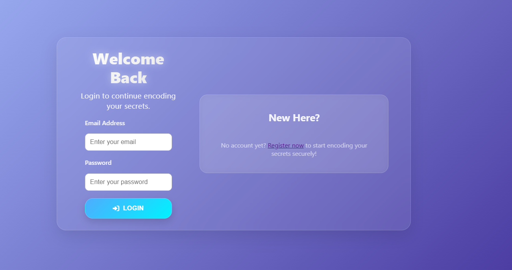
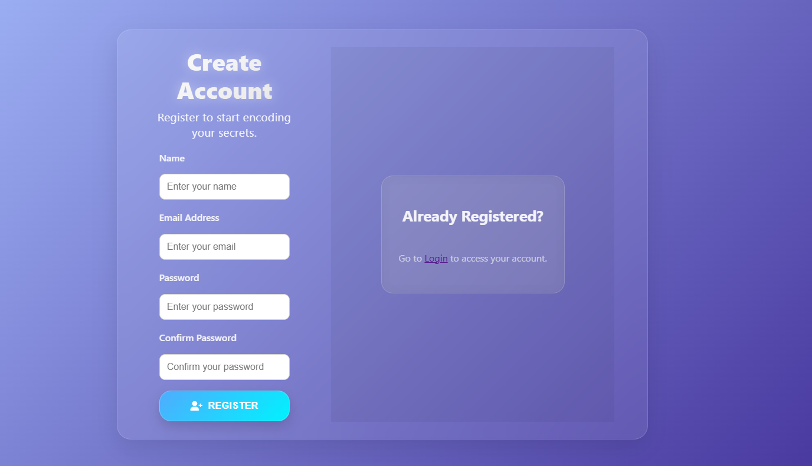

# Steganography Message Hider


**Steganography Message Hider** is a web-based steganography tool that allows you to hide and extract secret messages within images. With a clean and responsive user interface powered by HTML, CSS, and JavaScript, and a secure backend built in Python, Steganography makes message concealment simple, private, and elegant.

---

## Features

- **Image-Based Steganography**: Encode messages within JPEG or PNG images.
- **Encoding and Decoding**: Seamlessly hide or retrieve messages from images.
- **User Authentication & Session Management**: Secure login and registration with isolated user sessions.
- **MySQL Database Integration**: All user accounts and history logs are stored in a structured and scalable relational database.
- **Encoding/Decoding History**: Track and view past steganography actions per user.
- **Offline Capable**: Run locally without internet access or external APIs.
- **Beautiful UI**: Responsive and elegant frontend built with HTML/CSS/JavaScript.
- **Privacy-First**: Fully local processing with no external data transfers.
- **Simple UX**: Just upload an image, type your message, and you're done!

---


---

## How It Works

### Encoding
1. Upload a carrier image.
2. Enter the message you want to hide.
3. The Python backend embeds the message using **Least Significant Bit (LSB)** technique.
4. Download the new stego-image.

### Decoding
1. Upload a previously encoded image.
2. Backend extracts and returns the hidden message.

---

### LSB Technique Explanation
The Least Significant Bit (LSB) technique is a simple but powerful method for hiding data in images. Every pixel in an image is made up of RGB values, each of these values is stored as an 8-bit binary number.
LSB works by modifying the last bit (the least significant one) of these binary values. Since the change in the last bit causes almost no visible difference in the image, it allows data to be hidden invisibly.

For example:
Original Red value = 11100110 (230)
After encoding = 11100111 (231) — The difference is visually unnoticeable, but now contains part of your message.

This is repeated across many pixels to embed the full message bit by bit.

---

## Tech Stack
| Layer           | Technology                   |
|------------------|------------------------------|
| Frontend         | HTML5, CSS3, JavaScript       |
| Backend          | Python 3, Flask (with Sessions) |
| Database         | MySQL (via Flask-MySQL or pymysql) |
| Authentication   | Flask-Login, Flask Sessions   |
| Image Processing | Pillow (PIL)                  |
| Async Tasks      | Celery + Redis                |


---

## Interface Previews

### Home Page
This is the page that welcomes you when you start the application (Steganography Studio).


### Encoding Page
On this page, you can upload the picture and write the text you want to hide in the image.
Example:
- Text: Hello World.


### Decoding Page
This page gives you the ability to decode the message by uploading the image.
Decoded Text:
- Hello World.


### Login Interface
This is the page where you can log in.


### Registration Interface
This is the page where you can register.


---

## Installation & Running (with Docker)

### Prerequisites
- Docker & Docker Compose

### Steps
```bash
# Clone the repository
git clone https://github.com/safi-io/SteganographyMessageHider
cd SteganographyMessageHider

# Build and start all services (Flask, MySQL, Redis, Celery)
docker-compose up --build

# Visit in your browser
http://127.0.0.1:5000
```

This will start:
- Flask web server (with hot reload)
- MySQL database
- Redis server (for Celery broker)
- Celery worker (for async encoding tasks)

You can monitor Celery logs in the `celery_worker` container.
### Project Structure
```bash
SteganographyMessageHider/
├── app.py
├── helper.py
├── requirements.txt
├── docker-compose.yml
├── Dockerfile
├── README.md
├── ProjectDocumentation.pdf
├── output/                # Encoded images and zip files
├── uploads/               # Uploaded images
├── routes/
│   ├── main.py
│   ├── encode.py
│   ├── decode.py
│   ├── auth.py
│   ├── history.py
├── utils/
│   ├── database.py
│   ├── login_decorator.py
│   ├── tasks.py           # Celery async tasks
├── static/
│   ├── css/
│   │   ├── index.css
│   │   ├── encode.css
│   │   ├── decode.css
│   │   ├── login.css
│   │   ├── register.css
│   ├── js/
│   │   ├── index.js
│   │   ├── encode.js
│   │   ├── decode.js
├── templates/
│   ├── index.html
│   ├── encode.html
│   ├── decode.html
│   ├── login.html
│   ├── register.html
│   ├── history.html
├── screenshots/           # UI screenshots
│   ├── homepage.png
│   ├── encoding.png
│   ├── decoding.png
│   ├── login.png
│   ├── register.png
```
## Celery for Async Encoding

To maintain responsiveness and allow multiple images to be encoded in parallel, Celery is used for background task processing. When you encode images, each encoding job is sent to a Celery worker (using Redis as the broker). This means:
- The web server stays fast and responsive, even for large images or multiple uploads.
- You can check the status of encoding jobs and download all results as a zip file when ready.
- Celery is fully managed via Docker Compose and runs in its own container.

## Security

Steganography is built with privacy and security at its core. Here's how your data stays safe:

-  **No External Data Transfers**  
  All image and message processing is done locally on your machine. Nothing is sent to third-party servers or cloud storage.

-  **Temporary File Handling**  
  Uploaded files are stored temporarily and removed automatically after encoding or decoding is complete.

-  **No Analytics or Tracking**  
  The application does not include cookies, trackers, or analytics scripts, ensuring a clean and private experience.

-  **Offline-Ready**  
  You can run SteganographyMessageHider completely offline. Just install the dependencies, start the server, and use it locally.

-  **Local-Only Execution**  
  The backend server runs on your local machine, and the frontend interacts only with it, avoiding exposure to the internet.

>  Your messages stay yours. SteganographyMessageHider ensures data confidentiality and local control.


## Contact

For any queries, please feel free to reach out:

**Email:** [m.safi.ullah@outlook.com](mailto:m.safi.ullah@outlook.com)

---

Thank you for exploring!
